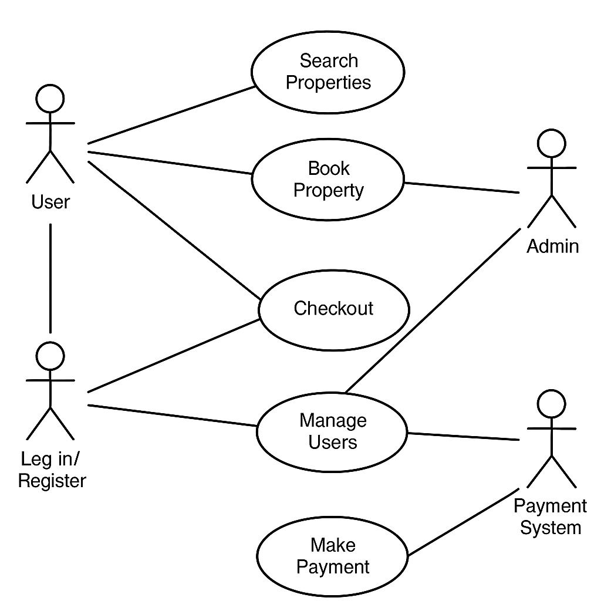

# Requirement Analysis in Software Development

This repository contains the documentation and deliverables for the Requirement Analysis phase of the Software Development Lifecycle (SDLC).

## What is Requirement Analysis?
Requirement Analysis is the process of gathering, analyzing, and documenting the requirements for a software system. It helps in understanding what stakeholders need and ensures that the system being developed aligns with those needs. It is a crucial phase in the Software Development Lifecycle (SDLC).

## Why is Requirement Analysis Important?
1. **Clarity of Requirements**: It helps in understanding exactly what is needed from the system.
2. **Preventing Scope Creep**: Properly defined requirements help in preventing unnecessary changes during development.
3. **Successful Project Execution**: It ensures that the final product aligns with user needs, leading to better user satisfaction.

## Key Activities in Requirement Analysis
- **Requirement Gathering**: Collecting initial data from stakeholders.
- **Requirement Elicitation**: Identifying additional requirements through discussions, surveys, etc.
- **Requirement Documentation**: Writing down requirements in structured formats.
- **Requirement Analysis and Modeling**: Analyzing the requirements and creating models like flowcharts.
- **Requirement Validation**: Ensuring the requirements meet stakeholder expectations.

## Types of Requirements

### Functional Requirements
These describe the core features of the system, such as:
- User login and registration.
- Property search and booking features.

### Non-functional Requirements
These define how the system performs and include:
- **Performance**: The system should load within 2 seconds.
- **Security**: The system should implement encryption for user data.

## Use Case Diagrams
Use Case diagrams represent the interactions between users and the system. Below is the use case diagram for the booking system.

## Acceptance Criteria
Acceptance criteria define the conditions a feature must meet to be considered complete. For example, for the Checkout feature:
- The user should be able to complete the booking after entering payment details.
- The system must send a booking confirmation email.
- The system must display a confirmation page after successful payment.
